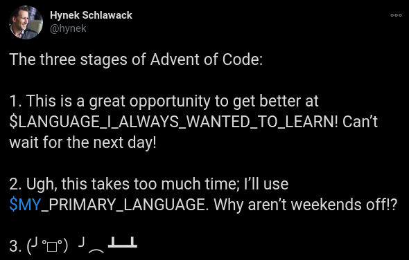

# advent-of-code-2020

Solutions to advent of code puzzles in various programming languages

Main solutions are mostly going to be written in go, but sometimes in other languages
as well. All the solutions are going to be rewritten in rust (`riir` directory).

At least some of the solutions are hopefully going to be streamed live on [aleksacu](https://twitch.tv/aleksacu)
twitch channel

## Stages of Advent of Code



I reached stage 2 on day 3. Hopefully I don't reach stage 3.

## Getting started

In some cases you need to change directory, either because of the input path or
because the compiler requires it.

### Go

```shell script
cd day1
go run main.go
```

### Rust

```shell script
cd riir
cargo run --bin day1
```

### Python

```shell script
python day3/main.py
```

## Solutions

| Day                                      | Languages                                         |
| ---------------------------------------- | ------------------------------------------------- |
| [1](https://adventofcode.com/2020/day/1) | [go](day1/main.go), [rust](riir/day1/main.rs)     |
| [2](https://adventofcode.com/2020/day/2) | [go](day2/main.go), [rust](riir/day2/main.rs)     |
| [3](https://adventofcode.com/2020/day/3) | [python](day3/main.py), [rust](riir/day3/main.rs) |
| [4](https://adventofcode.com/2020/day/4) | [python](day4/main.py), [rust](riir/day4/main.rs) |
| [5](https://adventofcode.com/2020/day/5) | [python](day5/main.py), [rust](riir/day5/main.rs) |
